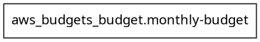
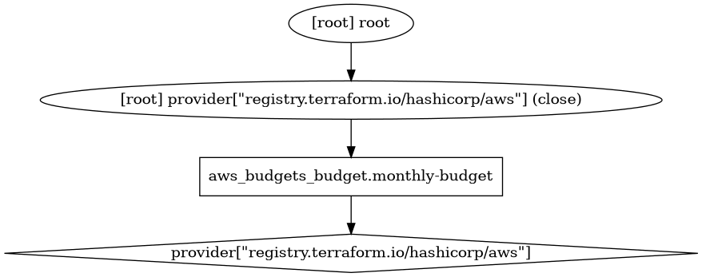

## Graph View - Init

```
terraform init
terraform graph | dot -Tpng > graph.png
```



## Graph View - Plan

```
terraform plan
terraform graph -type=plan | dot -Tpng > graph.png
```




## Console


